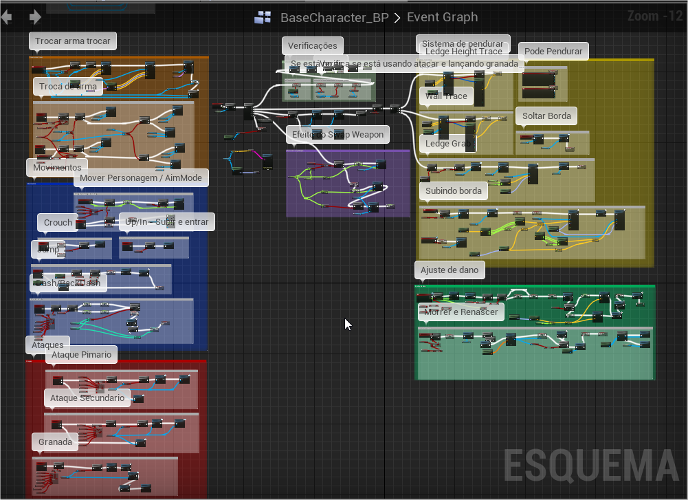
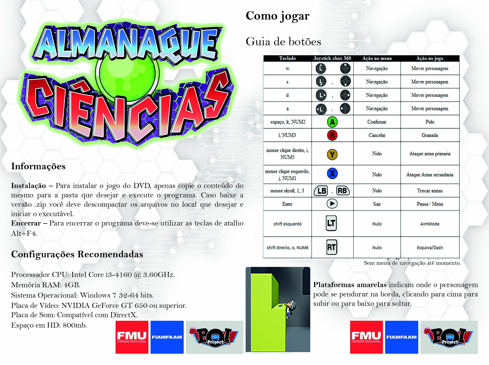

<h1>Almanaque Ciências</h1>
<h3>Projeto TCC 

Descrição: Jogo de plataforma e aventura, inspirado em jogos como Megaman X e Daffy Duck in Hollywood. 

Plataforma: Unreal 
Linguagem: Blueprint 

<a href="https://drive.google.com/drive/folders/1f0SEMTMEMNB0qc7xgdSYja8PdlOYCHSe">Link para Download da Demo</a>

<h3>Mecânicas de destaque:</h3>

- Câmera dinâmica, possuindo 4 tipos(neutro, vertical, horizontal, duplo) de alinhamento e com offset em todos.

- Cel-Shading, gráfico similar a cartoon games, cada personagem com um vetor próprio de luz.

- Ledge grab, sistema de pendurar em bordas.

Para mais detalhes veja o GDD 

Banca avaliadora pontuou o projeto com nota: 9,5  
Sendo critérios de avaliação:  
DEMO/GAMEPLAY: 5 de 5  
DOCUMENTAÇÃO: 2,5 de 3  
ENTREGA: 1 de 1  
APRESENTAÇÃO: 1 de 1</h3>

Assista o vídeo 

Capa 

Manual 

