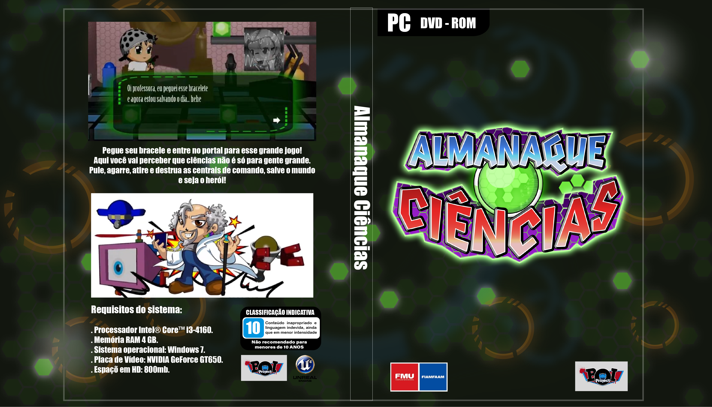

<h1>Almanaque Ciências</h1>
<h3>Projeto TCC 

Descrição: Jodo de plataforma e aventura, inspirado em jogos como Megaman X e Daffy Duck in Hollywood. 

Plataforma: Unreal 
Linguagem: Blueprint 

Para mais detalhes veja o GDD 

Banca avaliadora pontuou o projeto com nota: 9,5  
Sendo critérios de avaliação:  
DEMO/GAMEPLAY: 5 de 5  
DOCUMENTAÇÃO: 2,5 de 3  
ENTREGA: 1 de 1  
APRESENTAÇÃO: 1 de 1</h3>

